# 🤝 Kollaborate  

    
  
  
 

**A modern iOS app for collaboration, discussions, and project management.**  
Built with **SwiftUI** and powered by **Supabase**, Kollaborate provides a space where users can share updates, explore projects, manage tasks, and connect with peers.  

---

## 📖 Project Overview  

Kollaborate is designed for **professionals, students, and teams** who want a single platform for:  
- Posting **discussions & announcements**  
- Exploring **new people & projects**  
- Managing and tracking **tasks**  
- Building and maintaining **profiles**  

✨ Think of it as a **hybrid between a social feed and a project management tool**.  

---

## 🛠 Core Technologies  

- **Framework:** [SwiftUI](https://developer.apple.com/xcode/swiftui/) (declarative UI)  
- **Backend:** [Supabase](https://supabase.com/)  
  - 🔑 Authentication → Secure login & registration  
  - 📂 Database → Threads, tasks, and user data  
  - 📦 Storage → User profile images & media  
- **Database:** PostgreSQL (via Supabase)  
- **Image Loading & Caching:** [Kingfisher](https://github.com/onevcat/Kingfisher)  
- **Concurrency:** Swift Concurrency + [Point-Free libraries](https://github.com/pointfreeco)  
- **Security:** [swift-crypto](https://github.com/apple/swift-crypto)  

---

## 📸 Screenshots  

**Actual app looks even better in action!** 😍  

  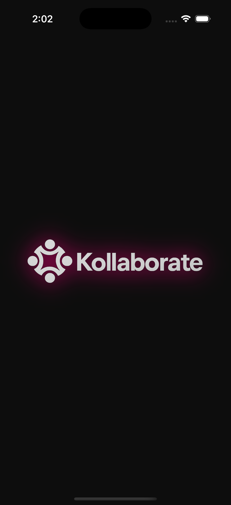
  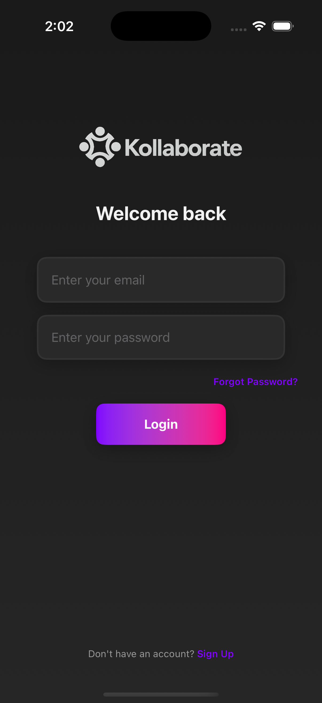
  
  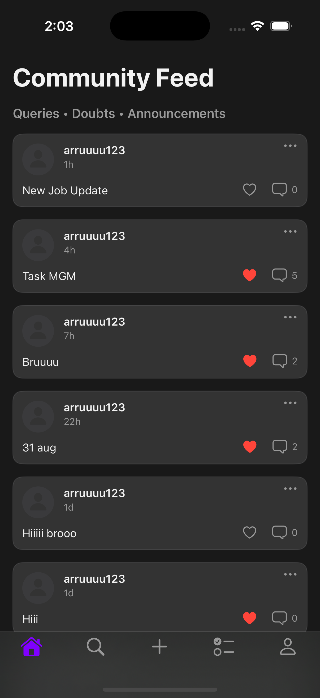
  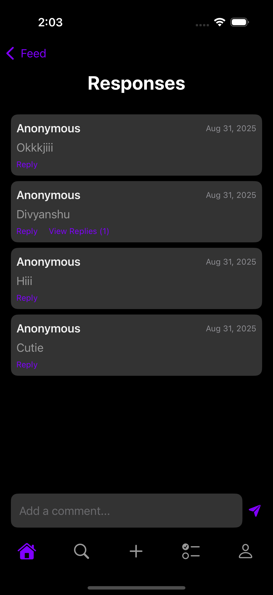
  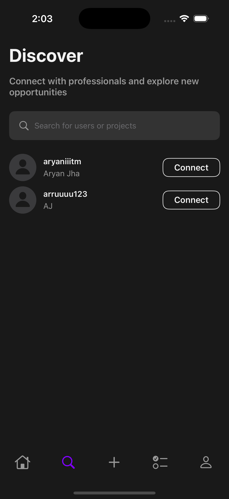
  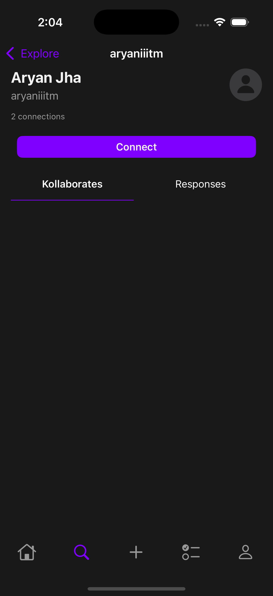
  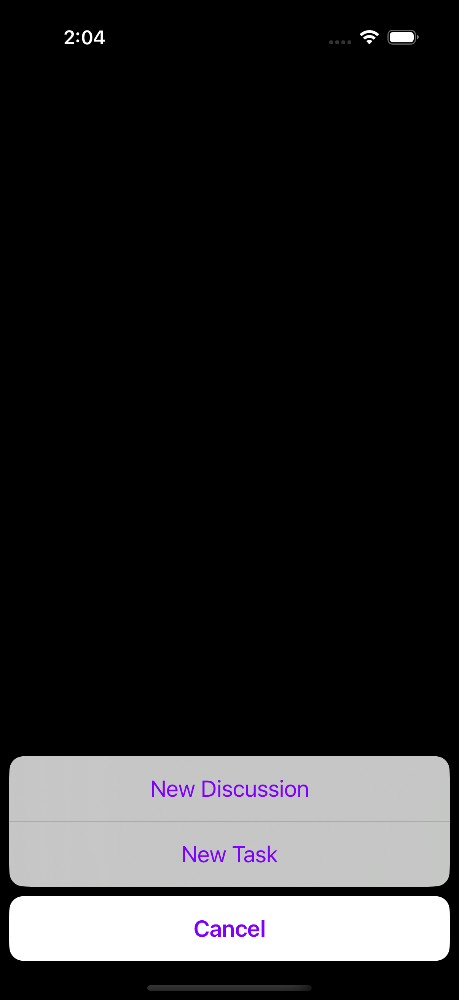
  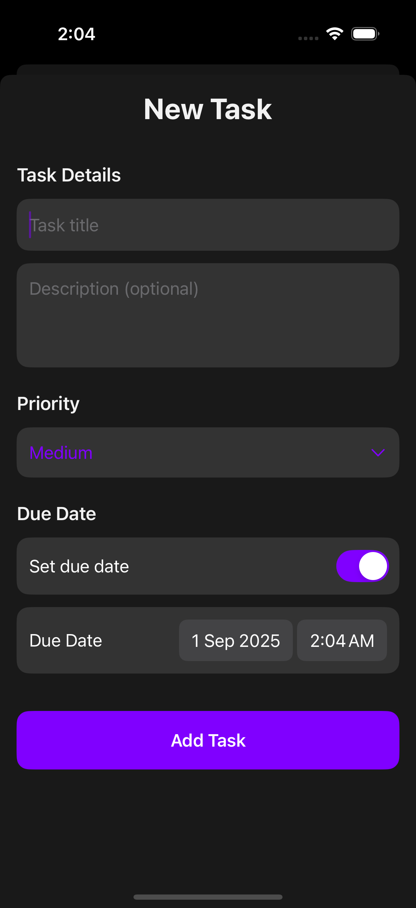
  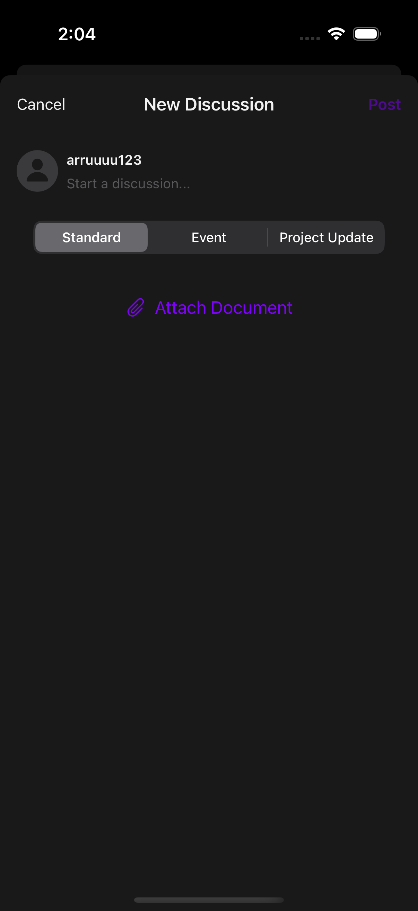
  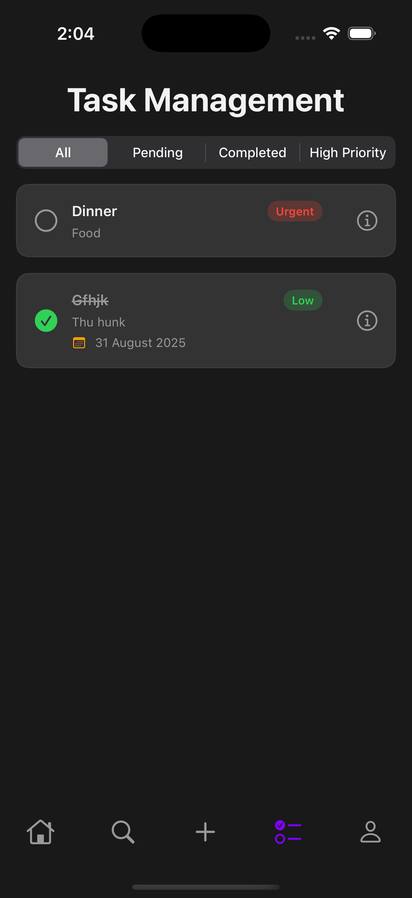
  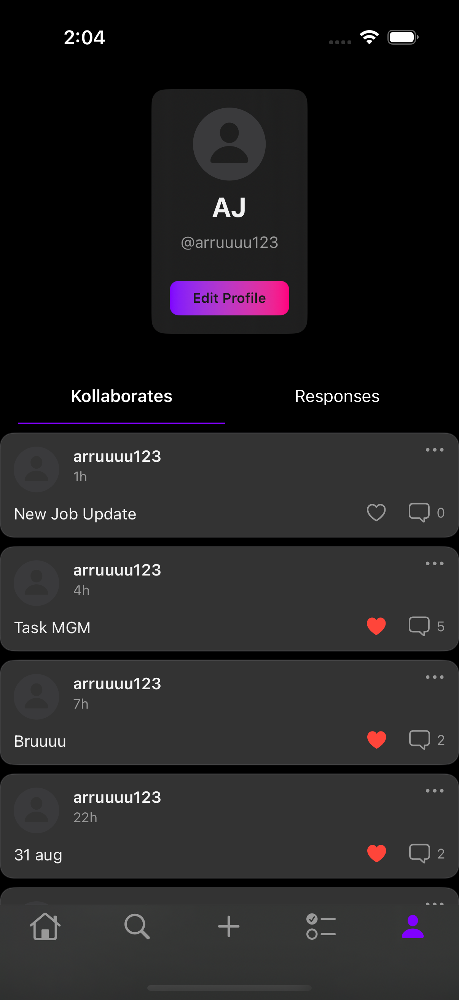

---

## ✨ Features  

- 📰 **Feed** → Discussions, updates & announcements  
- 🔍 **Explore** → Discover projects & collaborators  
- 📋 **Task Management** → Create, assign, and track tasks  
- ✍️ **Content Creation** → Start threads & add tasks  
- 👤 **Profiles** → View & edit user profiles  
- 🎨 **Modern UI** with clean SwiftUI design & animations  

---

## 🔄 Application Flow  

- **Splash Screen** → Auth state check  
- **Login / Signup** → Supabase Auth (email/password)  
- **Feed Screen** → Central hub for activity  
- **Explore Screen** → Projects & collaborators  
- **Task Screen** → Task lists & assignments  
- **Create Screens** → New discussions & tasks  
- **Profile Screen** → User info & settings  

---

## 📂 Project Structure  

- Kollaborate/  
  ┣ Models/         # Data models (User, Thread, Task)  
  ┣ Services/       # Supabase API integration  
  ┣ Views/          # SwiftUI screens  
  ┣ Components/     # Reusable UI components  
  ┣ Assets/         # App assets (icons, images)  

---

## 💬 Feedback & Contact  

- We’d love your thoughts and feedback!  
- 📧 aryanjha230705@gmail.com  
